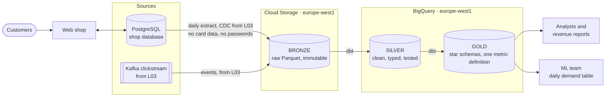

# Architecture

> Update this page at the end of every lesson. It is the diagram you present at
> the oral defence.

## Context

Albert's Marketplace's analysts, revenue reports and ML team all read from the
PostgreSQL database that runs the web shop. That slows checkout, exposes
passwords and card data, and produces revenue figures that disagree
([data flows](data-flows.md)). The platform has to give analysts and reports one
trusted revenue figure in SQL, and give the ML team units sold per product, per
country, per day. A daily refresh is enough for both. The constraints: card
data and passwords must never leave the shop, the shop database is read only by
the ingestion job, and the team is SQL-first and new to running cloud
infrastructure.

## Target architecture

Chosen in [ADR-0001](adr/0001-target-architecture.md): a **two-tier** platform.
Raw files live in Cloud Storage, and the warehouse in BigQuery is built from
them with dbt. Not yet decided: the extraction tool (L03) and the scheduler
(L07).

**Two boundaries in the diagram matter:**

- **The shop database:** only the extraction arrow crosses it. Nothing else
  reads the shop database.
- **Gold:** consumers read nothing else. They never see bronze or silver.

## Layers

| Layer | What lands here | What it guarantees | Who reads it |
|---|---|---|---|
| **Bronze** (Cloud Storage) | One folder per source table, as Parquet, partitioned by load date. Columns are as extracted, minus `payment_details.card_no`, `cvv`, `expiry_date` and `customer.pwd`, which are never extracted. Clickstream events from L03 | **Exactly what the source sent at each load, never modified.** Files are only added, each one records its source and load time, so silver and gold can be rebuilt at any time | The pipeline's service account only |
| **Silver** (BigQuery) | One table per business entity (orders, order lines, products, customers, addresses, payments). Types and UTC timestamps are fixed, duplicates and the export's index column removed. Names, emails and phone numbers are pseudonymised | **Correct and consistent.** Every row has a unique, non-null key, foreign keys resolve, and types are enforced. dbt tests fail the build if not | The data team, to build and debug gold |
| **Gold** (BigQuery) | Star schemas and metrics for consumers. First: daily demand (units per product, country and day, [sketch](model/star-daily-demand.md)) and revenue | **One definition per figure, with a documented grain.** Revenue is computed in one model, from `price_at_purchase`. No direct identifiers. Partitioned by date | Analysts, revenue reports, ML team |

## Decisions

| ADR | Decision | Status |
|---|---|---|
| [0001](adr/0001-target-architecture.md) | Two-tier: raw Parquet in Cloud Storage, silver and gold in BigQuery, built with dbt | Accepted |

## Change log

| Lesson | What changed |
|---|---|
| L01 | First version: target architecture, layer guarantees, ADR-0001 |
