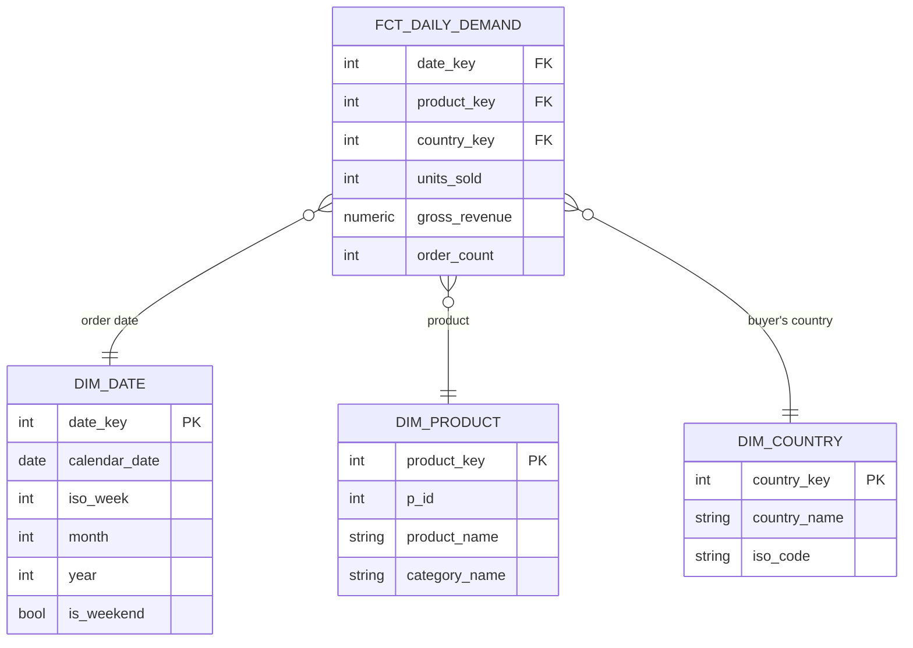

# Star schema: daily demand

The ML team's request: **units sold per product, per country, per day.**

The figures below come from the v1.0.0 export (`legacy_csv`). We build this
table for real, with tests, in L05.

## 1. Business process

**Order placement.** A buyer places an order, and each order line records a
product, a quantity and the price paid (`order_items`). We measure what was
**ordered**, not what was shipped (`shipment`) or returned (`returns`).

## 2. Grain

**One row per product, per buyer's country, per order date, for every
combination where at least one unit was ordered.**

Three choices are behind that sentence:

- **Day:** `orders.order_date`, which is already a date with no time, so no
  time zone is involved. The export covers 1,096 days, from 15 Sep 2023 to
  14 Sep 2026.
- **Country:** the order carries no address, so it comes from the buyer's
  default shipping address: `orders.buyer_id` → `customer_shipping`
  (`is_default = 1`) → `shipping_details.country`. In the export, every order
  resolves, each buyer has exactly one default address, and no buyer has
  addresses in two countries. That holds for this snapshot, not in general:
  see *Open questions*.
- **Only days with sales get a row.** Every product × country × day would be
  42,858 × 6 × 1,096 = 281.8 M rows, 99.9 % of them zero. Keeping only
  combinations with sales gives 365,512 rows. **A missing row means zero
  units.** The ML team adds the zeros with a date spine if their model needs
  them.

## 3. Dimensions

| Dimension | Key | Attributes | Source |
|---|---|---|---|
| `dim_date` | `date_key` | date, day of week, ISO week, month, quarter, year, is weekend | Generated, one row per calendar day |
| `dim_product` | `product_key` | `p_id`, product name, category name | `product`, `category` (2 categories) |
| `dim_country` | `country_key` | country name, ISO 3166 code | `shipping_details.country` (6 countries: Belgium, France, Germany, Italy, Netherlands, Spain) |

## 4. Facts

| Fact | Definition | Additive? |
|---|---|---|
| `units_sold` | Σ `order_items.qty` | **Yes,** across every dimension. This is the figure the ML team asked for |
| `gross_revenue` | Σ `qty` × `price_at_purchase` | **Yes,** across every dimension. It uses the price paid, not today's `product.price` (see [data flows](../data-flows.md)) |
| `order_count` | Number of distinct orders containing the product | **Partly:** it sums across days and countries, but **not across products.** One order with two products would be counted twice |

Check against the export: Σ `units_sold` = 1,386,640, the same as Σ
`order_items.qty`.

## Diagram

## Columns the platform must carry from the first ingestion

Only these source columns feed this table. Bronze keeps all the others too,
but if any of these goes missing, the table cannot be built:

| Table | Columns |
|---|---|
| `orders` | `order_id`, `buyer_id`, `order_date` |
| `order_items` | `order_id`, `p_id`, `qty`, `price_at_purchase` |
| `customer_shipping` | `c_id`, `address_id`, `is_default` |
| `shipping_details` | `address_id`, `country` |
| `product` | `p_id`, `p_name`, `category_id` |
| `category` | `category_id`, `name` |

`orders.buyer_id` matches `customer.c_id`: all 100,000 buyers are customers.
Street, zip code and phone are not needed here, so gold never holds them.

## Open questions

- **Address changes.** If a buyer changes default address, today's join moves
  their past orders to the new country. Once CDC arrives (L03), use the address
  that was the default on the order date.
- **Cancellations and returns.** `orders` has no status column, every payment
  is `completed`, and `returns` is empty in this export. If returns appear, add
  `units_returned` as a separate fact rather than netting it out silently.
- **Sellers.** `seller_products` links products to sellers. The ML team did not
  ask for a seller dimension, so it is left out until someone does.
